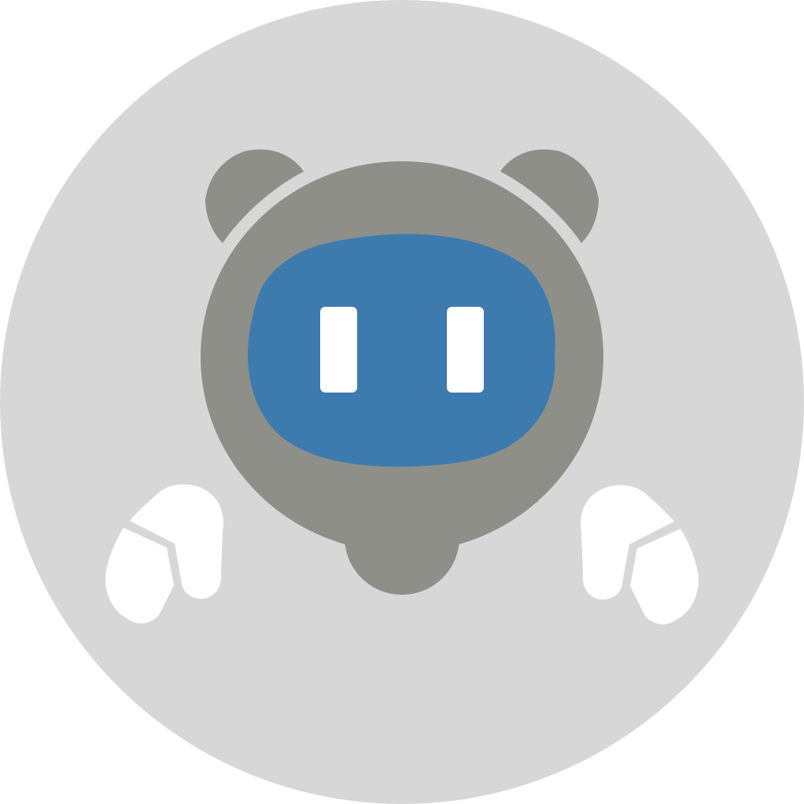

<p align="center">
  
</p>

<h1 align="center">Cahciua</h1>

<p align="center">
  基于 Deterministic Context Pipeline (DCP) 架构的 Telegram 群聊 AI Bot<br>
  <a href="https://github.com/memohai/Memoh">Memoh</a> 的研究性附属项目
</p>

---

Cahciua 是一个 Telegram 群聊机器人，通过 LLM 自主决定何时参与对话并生成回复。

## DCP — Deterministic Context Pipeline

> “如果人生的上下文可以倒带，可否让我用无尽的重载，去编排那个完美的未来？”

作为 Cahciua 的核心架构，DCP 是一条纯函数流水线，将平台事件确定性地转化为 LLM 上下文：

1. **Adaptation** — 将从 IM（Telegram）收到的事件转换为平台无关的（Canonical IM Event）
2. **Projection** — 纯函数 reducer，将事件流归约为结构化的中间上下文（Intermediate Context）
3. **Rendering** — 将 Intermediate Context 序列化为分段的、provider 无关的 XML 渲染上下文（Rendered Context）
4. **Driver** — 有状态的编排层，将 Rendered Context 与历史对话轮次（Turn Responses）按时间线合并，通过监视条件触发副作用来执行 LLM 调用

不维护上下文，而是维护上下文的构造过程 —— 任何一部分都可以单独运行测试，甚至用于在备好的数据集上评测与迭代。冷启动重放与实时处理能够产生相同的上下文序列。  
—— 这就是 *Deterministic* 的含义

## 特性

- **DCP 四层流水线** — Adaptation → Projection → Rendering → Driver，通过外部事件和历史轮次编排出确定的 LLM 上下文
- **自主回复决策** — Bot 通过 tool call 决定是否回复，而非被动触发
- **KV Cache 友好** — append-only 历史、静态 system prompt、基于 epoch 的压缩设计
- **消息防注入** — XML fencing 隔离用户消息内容，防止 prompt injection

## 开始使用

本项目提供了完善的 [`AGENTS.md`](AGENTS.md)，推荐使用 [Claude Code](https://docs.anthropic.com/en/docs/claude-code)、[Codex](https://openai.com/index/introducing-codex/) 等 coding agent 来调研、理解和使用本项目。

```bash
# 克隆项目后，直接在项目目录启动 coding agent 即可
claude   # Claude Code
codex    # OpenAI Codex
```

Coding agent 会自动阅读 `AGENTS.md` 中的架构文档，理解项目结构与设计决策，并协助你完成配置、开发和调试。
