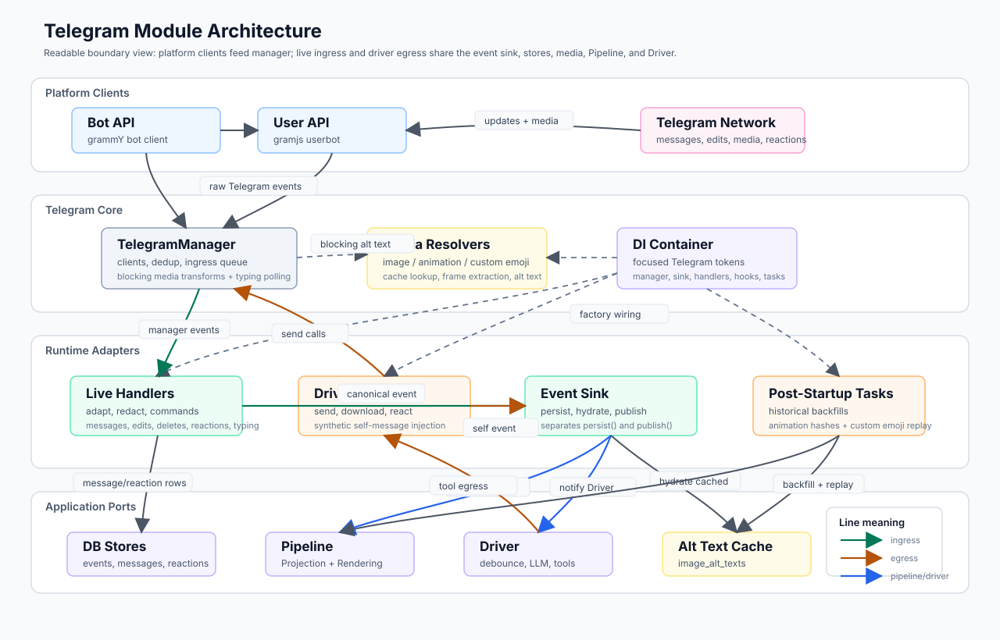

# Telegram Module Architecture

This is the human-readable overview of the Telegram runtime split. The diagram intentionally omits method-level detail and shows only the main ownership boundaries and data flows.

## How To Read It

- **Platform Clients** are raw Telegram API boundaries. `Bot API` receives Bot API updates and sends as the bot account; `User API` receives MTProto-only events and downloads/fetches data the Bot API cannot see.
- **TelegramManager** owns the raw clients, deduplication, per-chat ingress queue, blocking media transforms, reaction actor hydration, and typing polling controls. It does not know about DB, Pipeline, Driver, or chat policy.
- **Live Handlers** adapt manager callbacks into canonical events, apply blocked-user policy, write message/reaction stores, handle typing, and register `/offline` / `/online`.
- **Driver Hooks** are the egress adapter used by Driver tools. They send Telegram messages, download media, refresh reactions, and inject synthetic self-message events.
- **Event Sink** centralizes the canonical event side effects: persist, optionally hydrate alt text, push to Pipeline, and optionally notify Driver.
- **Post-Startup Tasks** run after live handlers are active. They backfill historical animation hashes and resolve uncached custom emoji, then replay affected chats.
- **DI Container** wires the focused tokens: manager, event sink, message store, reaction store, live handlers, driver hooks, post-startup tasks, and final Telegram handle.

## Critical Ordering

- Normal message ingress: persist canonical event, persist Telegram message row, seed empty reaction snapshot if needed, then hydrate/push/notify through Event Sink.
- Edit/delete ingress: persist canonical event, persist platform edit/delete row, then publish to Pipeline and notify Driver.
- Bot self-message egress: send through Telegram, create synthetic canonical event, persist it, seed empty reaction snapshot, then publish to Pipeline without notifying Driver.
- Reaction additions: update actor snapshot first, then append canonical reaction events. Live reaction events update Pipeline but do not notify Driver.

## Files

- `src/telegram/manager.ts` — raw Telegram manager and startup manager factory.
- `src/telegram/live-handlers.ts` — live ingress adapter.
- `src/telegram/driver-hooks.ts` — Driver-facing egress adapter.
- `src/telegram/event-sink.ts` — canonical event persistence/publication boundary.
- `src/telegram/post-startup.ts` — historical Telegram backfill tasks.
- `src/telegram/stores.ts` — message/reaction persistence ports.
- `src/telegram/custom-emoji-resolver.ts` — Telegram Bot API adapter for the shared custom emoji resolver.
- `src/telegram/index.ts` — public exports and `TelegramStartupHandle` aggregation.
